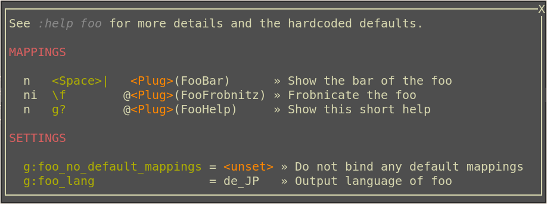

pluginhelp
==========

Introduction
------------

*pluginhelp* is a small library to display the current bindings of a
certain set of mappings and the current values of a certain set of
settings.

It is mainly intended for use in other plugins to provide an easy way to
list the available mappings and their actual bindings as well all the
possible settings and their current values.



Usage
-----

Call the function `pluginhelp#show()` to display the short help in a split
window (or in a popup / floating window if [skywind3000/vim-quickui] is
installed). Which mappings and settings should be displayed are specified as
the sole argument to that function. The actual bindings a settings values are
gathered at runtime.

See [pluginhelp#show()](#pluginhelpshow) for the details of that function.

It is advisable to provide `<Plug>`-mappings (see `:h using-<Plug>`) for all
the mappings to be listed by pluginhelp. It makes the help easier to read, is
less likely to misbehave due to certain special characters in the mapping
getting incorrectly parsed by pluginhelp and, in case you have many mappings
defined, it can speed up the display of the help windows as the possible
mappings can be filtered by the common prefix (like e.g. `<Plug>(Foo`)


### Usage in an ftplugin

To use this pluginhelp in an ftplugin it is recommended to provide a
buffer-local plug-map and bind it to `g?`

To avoid a hard dependency on *pluginhelp*, guard it by a check for its
existance in the runtimepath. If the user doesn't have *pluginhelp* installed,
the short help window cannot be displayed, but the plugin itself works as
intended (Be aware that this requires that *pluginhelp* was already loaded
when checking for it. See
[Asserting that pluginhelp is loaded before](#asserting-that-pluginhelp-is-loaded-before)
for some options to achieve this).

```vim
if exists('g:loaded_pluginhelp')
  let plugin_spec = …     " see :help pluginhelp#show()
  nnoremap <buffer> <silent> <Plug>(FooHelp)  :call pluginhelp#show(plugin_spec)<cr>
  nmap     <buffer> <silent> g?               <Plug>(FooHelp)
endif
```

### Usage in a non-ft plugin

To use this pluginhelp in a plugin that is not filetype specific is
basically the same as for ftplugins (see [Usage in an ftplugin](#usage-in-an-ftplugin)),
but the mapping to `g?` should be avoided, since this would too easily
conflict with other plugins using the same mechanism. Instead it is
recommended to provide a command for that purpose.

```vim
if exists('g:loaded_pluginhelp')
  let plugin_spec = …     " see :help pluginhelp#show()
  command! FooHelp   :call pluginhelp#show(plugin_spec)
endif
```

### Usage in vimrc

While the main purpose of *pluginhelp* is to be used in plugins, it is well
usable for having a short help for personal mappings and settings that aren't
easy to remember (for example if they are rarely used).
Of course you are free to use any mapping or command to call that help. See
[Usage in an ftplugin](#usage-in-an-ftplugin) and
[Usage in a non-ft plugin](#usage-in-a-non-ft-plugin) for some examples.


### Asserting that pluginhelp is loaded before

To check for the existence of *pluginhelp* in the users runtimepath, you must
assure that the check is done after loading it. There are two possibilities to
achieve this:

1. Use the `after` directory

   Write the code to prepare the *pluginhelp* mapping/command into a
   script in the `after/plugin` directory of your plugin. This script will
   be loaded after all other plugins are loaded and therefore it is
   asserted that the check for `g:loaded_pluginhelp` will succeed if
   *pluginhelp* is actually installed.

2. Use an autocmd on the `VimEnter` event

   The `VimEnter` event is executed after all plugins are loaded.
   Therefore it also asserts that the check for `g:loaded_pluginhelp` will
   succeed if *pluginhelp* is actually installed.

Functions
---------

The only function available is the function to open the help window:

- `pluginhelp#show({plugin_spec})`<a name="pluginhelpshow"></a>

    Display a window with the current bindings mappings and values of
    settings defined in `plugin_spec`.

    `plugin_spec` must be a dictionary containing all the information
    necessary to fill the help window. All of them are optional, but if none
    are given the result help window will be empty.

    `help_topic`: The topic that must be given to ':h' to display the
                  corresponding vimhelp file.
                  Used to display a line that refers to that help file.
    `mappings`:   A list of mappings to display. See below for details of
                  that list.
    `settings`:   A list of settings to display. See below for details of
                  that list

    The `mappings` and `settings` are lists with a dictionary per mapping /
    setting.
    Each entry in `mappings` must contain the following keys:

    `plugmap`:    The name of the `<Plug>`-Mapping (rhs of a mapping) to display.
    `desc`:       A short description of that mapping

    Each entry in `settings` must contain the following keys:

    `setting`:    The name of the setting to display.
    `desc`:       A short description of that setting

    ```vim
    let plugin_spec = {
      \ 'help_topic': 'foo',
      \ 'mappings':  [
      \    {'plugmap': '<Plug>(FooBar)',      'desc': 'Show the bar of the foo'},
      \    {'plugmap': '<Plug>(FooFrobnitz)', 'desc': 'Frobnicate the foo'},
      \    {'plugmap': '<Plug>(FooHelp)',     'desc': 'Show this short help'},
      \  ],
      \ 'settings':  [
      \    {'setting': 'g:foo_no_default_mappings', 'desc': 'Do not bind any default mappings'},
      \    {'setting': 'g:foo_lang',                'desc': 'Output language of foo'},
      \  ],
      \ }
    ```

Complementary Plugins
---------------------

 * [hupfdule/log.vim]

    To debug problems with vim-pluginhelp, log.vim might be of help.
    At the moment the only logging messages produced are:
    - if a provided mapping cannot correctly be parsed.
    - when the whole list of mappings is reduced to mappings matching some common substring

 * [skywind3000/vim-quickui]

    To display the help window in a floating window, vim-quickui needs to be
    installed.

Usage references
----------------

 * [vimpl/push.vim]

   A plugin for pushing the cursor or text to a “push stop” in a different line.
   Creates its pluginhelp command via [autocmd on `VimEnter`](https://github.com/vimpl/push.vim/blob/f55093e5fa8e087f884db6f5e54b72beab16940f/plugin/push.vim#L66-L93).

 * [vimpl/vim-subrip]

   A filetype pluging for subrip subtile files (with `.srt` extension).
   Creates its pluginhelp mapping in [`/after/plugin/pluginhelp.vim`](https://github.com/vimpl/vim-subrip/blob/d9a198dc252c291ef2ebe0ba32cb6fa968c2d172/after/plugin/pluginhelp.vim#L1-L13).

License
-------

This plugin is licensed under the terms of the MIT License.

http://opensource.org/licenses/MIT


[hupfdule/log.vim]: https://github.com/hupfdule/log.vim
[skywind3000/vim-quickui]: https://github.com/skywind3000/vim-quickui
[vimpl/push.vim]: https://github.com/vimpl/push.vim
[vimpl/vim-subrip]: https://github.com/vimpl/vim-subrip
